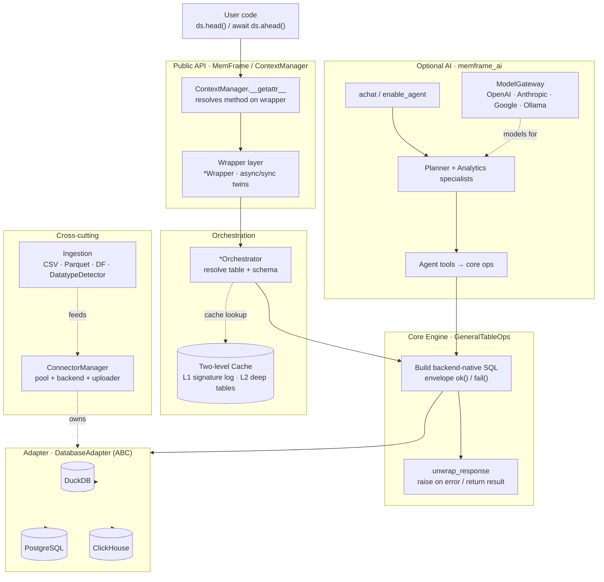

# Architecture

memFrame is a thin pandas-like API over a database engine. Every DataFrame-style
call is compiled to backend-native SQL and executed in-engine — your data never
leaves the database. The call path is a four-layer stack, with connection,
ingestion, and cache as cross-cutting subsystems, and an optional AI agent layer
on top.

## Layers

- **Public API** — `MemFrame` and the per-dataset `ContextManager` it returns
  after upload. `ContextManager.__getattr__` lazily resolves any method onto a
  wrapper; each wrapper exposes an `async`/`sync` twin (`ahead`/`head`) and
  delegates via `super()`.
- **Orchestration** — the `*Orchestrator` resolves the active `data_id` to a
  `table_name, schema` from the `csv_registry`, lazily builds the core ops
  engine, and applies the `@record_call` two-level cache.
- **Core engine** — `GeneralTableOps` builds and runs the backend-native SQL,
  returning a structured `{is_error, result, ...}` envelope; `unwrap_response`
  raises on error or returns the raw result. Plotting mirrors this with
  `*PlotCore`.
- **Adapter** — `DatabaseAdapter` is the only place that knows placeholder style
  (`?` vs `$1`), identifier quoting, and metadata queries, per backend.

## Cross-cutting subsystems

- **Connection** — `ConnectorManager` owns the lifecycle: connection pool, the
  `DatabaseBackend` (creates `csv_registry` / `transient_registry`, runs schema
  migrations), and the uploader.
- **Ingestion** — upload strategies for CSV / Parquet / pandas DataFrame plus a
  `DatatypeDetector` (encoding, delimiter, type inference).
- **Cache** — `record_call` is a `CacheManager` decorator. L1 (`deep_cache=False`,
  default) records call signatures as a lineage/audit log only; L2
  (`deep_cache=True`) persists result DataFrames as typed transient tables and
  replays them on a hit.

## Optional AI layer (`memframe_ai`)

`MemFrame.aenable_agent` / `ContextManager.achat` route natural-language prompts
through `entrypoints` into a fleet of Pydantic-AI agents — a `PlannerAgent` and
`AnalyticsAgent` specialists (inspect, select, clean, stats, arithmetic, plots).
Each agent tool calls the **same core ops engine** the API uses. `ModelGateway`
maps a provider to a Pydantic-AI model (OpenAI, Anthropic, Google, Ollama), with
`FallbackModel` support.
