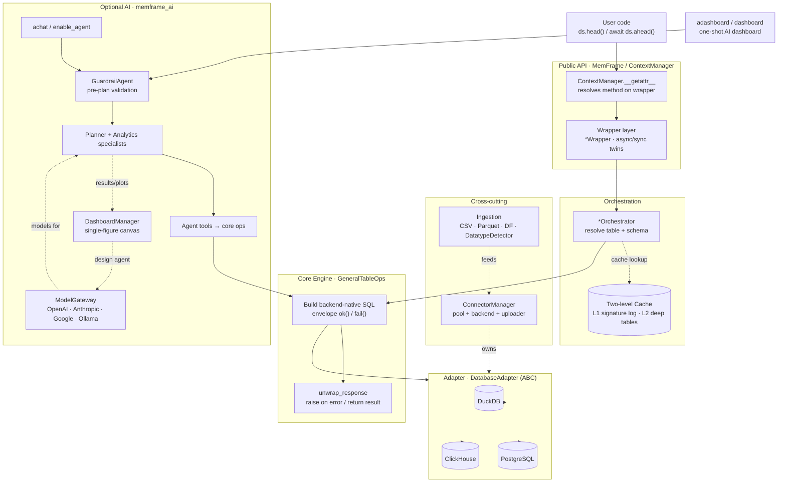

# Architecture

memFrame is a thin pandas-like API over a database engine. Every DataFrame-style
call is compiled to backend-native SQL and executed in-engine — your data never
leaves the database. The call path is a four-layer stack, with connection,
ingestion, and cache as cross-cutting subsystems, and an optional AI agent layer
on top.

## Layers

- **Public API** — `MemFrame` and the per-dataset `ContextManager` it returns
  after upload. `ContextManager.__getattr__` lazily resolves any method onto a
  wrapper; each wrapper exposes an `async`/`sync` twin (`ahead`/`head`) and
  delegates via `super()`.
- **Orchestration** — the `*Orchestrator` resolves the active `data_id` to a
  `table_name, schema` from the `memframe_csv_registry`, lazily builds the core ops
  engine, and applies the `@record_call` two-level cache.
- **Core engine** — `GeneralTableOps` builds and runs the backend-native SQL,
  returning a structured `{is_error, result, ...}` envelope; `unwrap_response`
  raises on error or returns the raw result. Plotting mirrors this with
  `*PlotCore`.
- **Adapter** — `DatabaseAdapter` is the only place that knows placeholder style
  (`?` vs `$1`), identifier quoting, and metadata queries, per backend.

## Cross-cutting subsystems

- **Connection** — `ConnectorManager` owns the lifecycle: connection pool, the
  `DatabaseBackend` (creates `memframe_csv_registry` / `memframe_transient_registry`, runs schema
  migrations), and the uploader.
- **Ingestion** — upload strategies for CSV / Parquet / pandas DataFrame plus a
  `DatatypeDetector` (encoding, delimiter, type inference).
- **Cache** — `record_call` is a `CacheManager` decorator. L1 (`deep_cache=False`,
  default) records call signatures as a lineage/audit log only; L2
  (`deep_cache=True`) persists result DataFrames as typed transient tables and
  replays them on a hit.

## Optional AI layer (`memframe_ai`)

`MemFrame.aenable_agent` / `ContextManager.achat` route natural-language prompts
through `entrypoints` into a fleet of Pydantic-AI agents. A **`GuardrailAgent`**
runs first and validates the prompt against the active table's columns (rebuilt
per query via `build_domain_context`); cross-dataset or off-topic requests are
rejected gracefully — `chat()` returns a refusal answer and `adashboard()` returns
a styled HTML page, never an exception. Toggle it with
`AISettings(guardrails_enabled=False)` (default on; fail-open on guardrail errors).

A `PlannerAgent` then decomposes the accepted prompt into a typed `SubQueryPlan`,
and `AnalyticsAgent` specialists (inspect, select, clean, stats, arithmetic,
plots) execute each sub-query by calling the **same core ops engine** the API
uses. `ModelGateway` maps a provider to a Pydantic-AI model (OpenAI, Anthropic,
Google, Ollama), with `FallbackModel` support.

For visualization, `ContextManager.adashboard()` / `dashboard()` collapse the
whole flow into one call: they reuse `achat()` on the **active dataset**, harvest
the returned results and plots, and feed them to `DashboardManager`, which renders
a **single full-screen Plotly figure** ("canvas") of subplot widgets. Only compact
summaries (shape, columns, 2-row sample, capped Plotly spec) reach the dashboard
LLM — never raw data values. The entire pipeline is opt-in Logfire-instrumentable
(see the agent docs): every agent run, LLM call, and tool call is traced, plus a
top-level request span.
